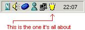



## Tray Drink

### Description

This doesn't do much, it just shows a drink in your system tray. As you will notice, the drink will get empty as time goes by. Right clicking the drink will enable you to configure the drinking speed, and of course the drink. I've included beer, wine and milk, but drinks can be added by creating your own set of icons, createing a folder in the icons dirctory, and adding icons called 100, 75, 50, 25, 0 and !. Nothing fancy, just for fun! Could be inplemented in your own application (again, just for fun)
 
### More Info
 

             |
---                |---
**Submitted On**   |2002-01-27 22:17:20
**By**             |[Networking\.be](https://github.com/Planet-Source-Code/PSCIndex/blob/master/ByAuthor/networking-be.md)
**Level**          |Beginner
**User Rating**    |4.7 (14 globes from 3 users)
**Compatibility**  |VB 5\.0, VB 6\.0
**Category**       |[Complete Applications](https://github.com/Planet-Source-Code/PSCIndex/blob/master/ByCategory/complete-applications__1-27.md)
**World**          |[Visual Basic](https://github.com/Planet-Source-Code/PSCIndex/blob/master/ByWorld/visual-basic.md)
**Archive File**   |[Tray\_Drink513871272002\.zip](https://github.com/Planet-Source-Code/networking-be-tray-drink__1-31251/archive/master.zip)

